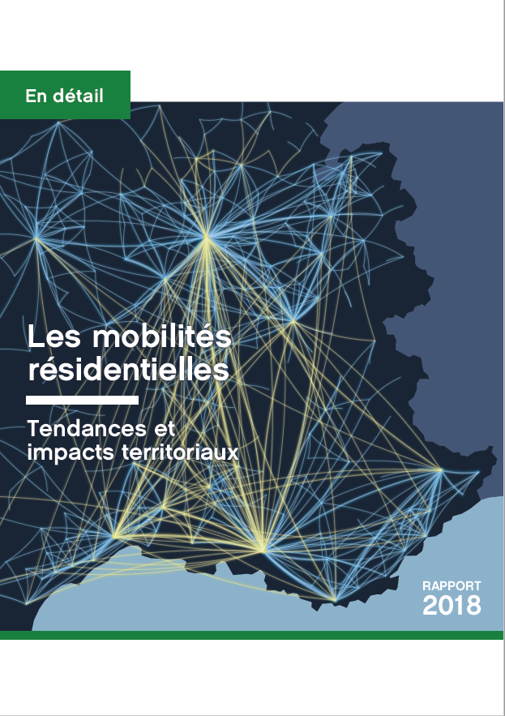

### L&apos;observatoire des territoires  

Depuis 2004, l&apos;Observatoire des territoires, anim&eacute; par le Commissariat g&eacute;n&eacute;ral &agrave; l&apos;&eacute;galit&eacute; des territoires (CGET), **rassemble, analyse et  diffuse les donn&eacute;es relatives aux dynamiques et aux disparit&eacute;s territoriales** ainsi qu&apos;aux politiques men&eacute;es dans le champ de l&apos;am&eacute;nagement et du d&eacute;veloppement des territoires. Organis&eacute; en r&eacute;seau (il dispose d&apos;un conseil d&apos;orientation de 30 membres repr&eacute;sentant les administrations, la soci&eacute;t&eacute; civile, les associations d&apos;&eacute;lus, divers organismes acteurs de l&apos;am&eacute;nagement du territoire ainsi que des chercheurs), il **favorise l&apos;harmonisation des m&eacute;thodes d&apos;observation et d&apos;analyse territoriale** entre l&apos;Etat et les collectivit&eacute;s, la mutualisation des connaissances, et cr&eacute;e les conditions de diagnostics partag&eacute;s sur l&apos;&eacute;tat des territoires. 
C&apos;est aussi un **lieu d&apos;innovation et d&apos;expertise** : l&apos;Observatoire anime un programme d&apos;&eacute;tudes et de recherches et contribue &agrave; la mise au point des cadres conceptuels et des outils adapt&eacute;s aux nouveaux besoins de comparaisons entre territoires &agrave; l&apos;&eacute;chelle fran&ccedil;aise et europ&eacute;enne. Il publie r&eacute;guli&egrave;rement des **rapports et analyses sur les dynamiques territoriales** et met &agrave; disposition la **cartographie interactive** de nombreuses donn&eacute;es statistiques &agrave; diff&eacute;rentes &eacute;chelles.

### Le rapport sur les mobilit&eacute;s r&eacute;sidentielles 

En 2018, l&apos;Observatoire des territoires s&apos;est notamment consacr&eacute; &agrave; une &eacute;tude approfondie sur les mobilit&eacute;s r&eacute;sidentielles des Fran&ccedil;ais. Cette derni&egrave;re a donn&eacute; lieu &agrave; un rapport paru en f&eacute;vrier 2019 et intitul&eacute; "Les mobilit&eacute;s r&eacute;sidentielles : tendances et impacts territoriaux". En voici quelques-uns des grands enseignements :

- En moyenne, chaque ann&eacute;e 11 % des Fran&ccedil;ais changent de logement. Plus des deux tiers d&apos;entre eux se r&eacute;installent &agrave; proximit&eacute; (dans la m&ecirc;me commune ou le m&ecirc;me d&eacute;partement), une proportion plus &eacute;lev&eacute;e pour certaines cat&eacute;gories de la population (les 40-55 ans, les individus pas ou peu dipl&ocirc;m&eacute;s, les ouvriers et les employ&eacute;s). A l&apos;inverse, les jeunes, les cadres et les individus les plus dipl&ocirc;m&eacute;s, mais aussi les retrait&eacute;s, sont les cat&eacute;gories qui parcourent les plus longues distances lorsqu&apos;ils d&eacute;m&eacute;nagent. Au cours des derni&egrave;res ann&eacute;es, on a observ&eacute; une baisse de la mobilit&eacute; r&eacute;sidentielle pour toutes les cat&eacute;gories de la population, plus prononc&eacute;e encore pour les mobilit&eacute;s de longue distance. En somme, les Fran&ccedil;ais d&eacute;m&eacute;nagent aujourd&apos;hui moins, et moins loin, que dans les ann&eacute;es 1990.

- D&apos;un point de vue territorial, les effets de ces d&eacute;m&eacute;nagements sont ambigus selon l&apos;&eacute;chelle que l&apos;on consid&egrave;re. Aux &eacute;chelles r&eacute;gionales et d&eacute;partementales, les disparit&eacute;s de dynamisme migratoire se sont creus&eacute;es au fil des derni&egrave;res d&eacute;cennies : le contraste entre le Nord-Est, qui peine &agrave; attirer de nouveaux habitants, et les r&eacute;gions de l&apos;Ouest et du Sud qui b&eacute;n&eacute;ficient du mouvement de littoralisation et d&apos;h&eacute;liotropisme, s&apos;est accru. Mais &agrave; l&apos;&eacute;chelle locale au contraire, le mouvement de desserrement de la population en p&eacute;riph&eacute;rie des grands p&ocirc;les urbains a eu pour effet de lisser les contrastes de solde migratoire entre les communes urbaines, p&eacute;riurbaines et rurales, m&ecirc;me si ce sont les deux derni&egrave;res cat&eacute;gories qui gagnent le plus d&apos;habitants par le jeu des mouvements r&eacute;sidentiels.

- Enfin, ce rapport montre que les d&eacute;m&eacute;nagements sont &agrave; l&apos;origine d&apos;une importante recomposition de la population &agrave; l&apos;&eacute;chelle locale. Parce que les choix r&eacute;sidentiels des individus et les contraintes qui p&egrave;sent sur eux sont tr&egrave;s li&eacute;s &agrave; des d&eacute;terminants sociaux, les mobilit&eacute;s r&eacute;sidentielles correspondent globalement &agrave; la logique du "qui se ressemble s&apos;assemble" : ainsi, les diff&eacute;rentes cat&eacute;gories de la population sont de plus en plus s&eacute;par&eacute;es dans des territoires distincts.

Cette application propose &agrave; chacun d&apos;acc&eacute;der aux chiffres cl&eacute;s permettant de d&eacute;cliner ces observations g&eacute;n&eacute;rales dans chaque territoire, des communes aux r&eacute;gions.

